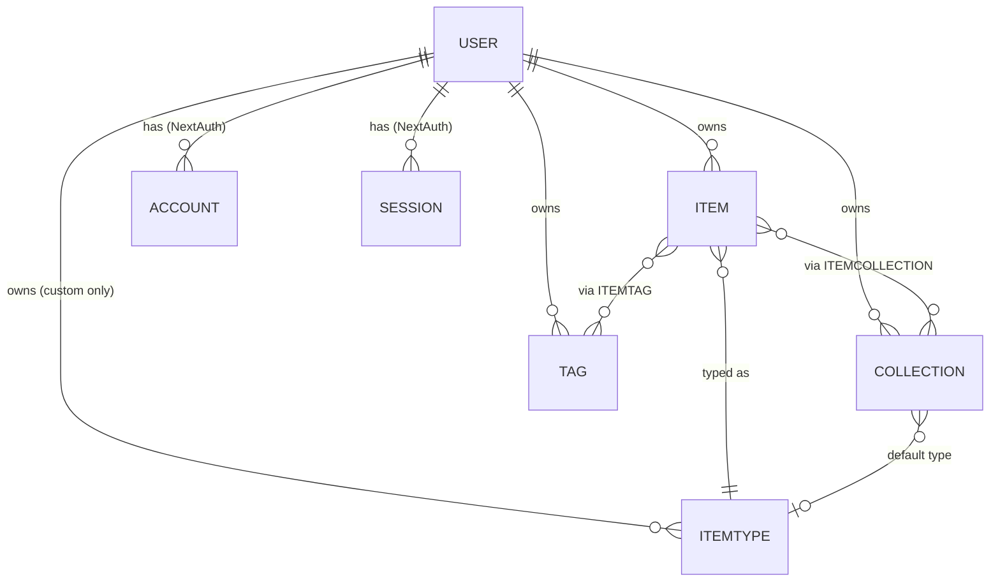
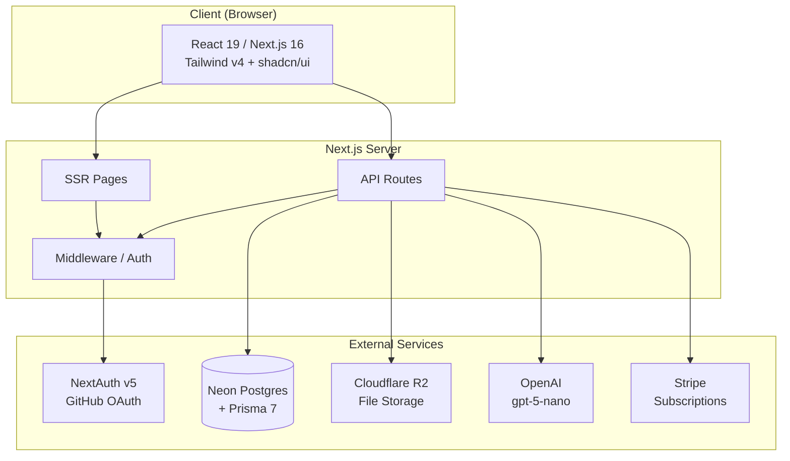

# DevStash — Project Overview

> **One fast, searchable, AI-enhanced hub for all developer knowledge & resources.**

A developer-first SaaS for storing code snippets, AI prompts, terminal commands, notes, links, and files — all in one place, with powerful search and optional AI enhancements.

---

## Table of Contents

- [Problem](#problem)
- [Target Users](#target-users)
- [Features](#features)
- [Data Model](#data-model)
- [Prisma Schema](#prisma-schema)
- [Architecture](#architecture)
- [Tech Stack](#tech-stack)
- [Monetization](#monetization)
- [UI / UX](#ui--ux)
- [Routing Conventions](#routing-conventions)
- [Development Notes](#development-notes)

---

## Problem

Developers keep their essentials scattered across too many tools:

| Where it lives today            | What's stored there         |
| ------------------------------- | --------------------------- |
| VS Code / Notion                | Code snippets               |
| AI chat histories               | Prompts & system messages   |
| Buried project folders          | Context files               |
| Browser bookmarks               | Useful links                |
| Random directories              | Docs, cheatsheets           |
| `.txt` files on the desktop     | Terminal commands           |
| GitHub gists                    | Project templates           |
| `~/.bash_history`               | Previously-used commands    |

The result: constant context switching, lost knowledge, and inconsistent workflows.

**DevStash** consolidates all of it into one searchable, AI-enhanced hub.

---

## Target Users

- **Everyday Developer** — needs a fast way to grab snippets, prompts, commands, and links.
- **AI-first Developer** — saves prompts, contexts, workflows, and system messages.
- **Content Creator / Educator** — stores code blocks, explanations, and course notes.
- **Full-stack Builder** — collects patterns, boilerplates, and API examples.

---

## Features

### A. Items & Item Types

Items are the core unit of content. Each item has a **type** that determines how it's rendered and stored. Users can create custom types later (Pro), but the following system types ship out of the box and cannot be modified:

| Type      | Storage | Plan       | Lucide Icon  | Color                    |
| --------- | ------- | ---------- | ------------ | ------------------------ |
| `snippet` | text    | Free & Pro | `Code`       | `#3b82f6` — blue         |
| `prompt`  | text    | Free & Pro | `Sparkles`   | `#8b5cf6` — purple       |
| `command` | text    | Free & Pro | `Terminal`   | `#f97316` — orange       |
| `note`    | text    | Free & Pro | `StickyNote` | `#fde047` — yellow       |
| `link`    | url     | Free & Pro | `Link`       | `#10b981` — emerald      |
| `file`    | file    | **Pro**    | `File`       | `#6b7280` — gray         |
| `image`   | file    | **Pro**    | `Image`      | `#ec4899` — pink         |

Each item's storage kind (text / file / url) is captured on the item itself via the `contentType` enum, making queries and rendering straightforward. Item creation and detail views open in a **quick-access drawer** — never a full page navigation.

### B. Collections

Users can create collections that hold items of any type. **An item can belong to multiple collections** (e.g., a React snippet could live in both *"React Patterns"* and *"Interview Prep"*).

Example collections:

- **React Patterns** — snippets, notes
- **Context Files** — files
- **Python Snippets** — snippets
- **Prototype Prompts** — prompts

Collection cards are color-coded by the item type they hold most of.

### C. Search

Powerful search across:

- Content
- Tags
- Titles
- Types

### D. Authentication

- Email / password
- GitHub OAuth
- Powered by **NextAuth v5**

### E. Additional Features

- Favorites (items and collections)
- Pinning items to the top
- "Recently used" list (tracked via `lastUsedAt`)
- Import code from a file
- Markdown editor for text types (with syntax highlighting for code blocks)
- File upload for file / image types
- Export data in multiple formats (JSON / ZIP — Pro)
- Dark mode by default, light mode optional
- Add / remove items from multiple collections
- View which collections an item belongs to

### F. AI Features (Pro only)

Powered by **OpenAI `gpt-5-nano`**:

- **AI auto-tag suggestions** — generates relevant tags from content
- **AI summaries** — condenses long notes / snippets
- **AI Explain This Code** — walks through what a snippet does
- **Prompt optimizer** — refines saved prompts for better LLM output

---

## Data Model

### Entity Relationship Diagram



### Entity Summary

| Entity             | Purpose                                                                |
| ------------------ | ---------------------------------------------------------------------- |
| **User**           | Extends NextAuth; tracks Pro status and Stripe IDs                     |
| **Item**           | A single piece of stored content (snippet, prompt, file, link, etc.)   |
| **ItemType**       | Either a system type (seeded) or a user-defined custom type            |
| **Collection**     | A named group of items (many-to-many with Item)                        |
| **ItemCollection** | Join table; stores `addedAt` for ordering                              |
| **Tag**            | Per-user tag; many-to-many with Item                                   |
| **ItemTag**        | Join table                                                             |

---

## Prisma Schema

> Using **Prisma 7** with the **Neon Postgres** connection. Always create migrations — never `db push` against dev or prod.

```prisma
// schema.prisma

generator client {
  provider = "prisma-client-js"
}

datasource db {
  provider = "postgresql"
  url      = env("DATABASE_URL")
}

// ============================================================
// Auth (NextAuth v5 adapter)
// ============================================================

model User {
  id            String    @id @default(cuid())
  name          String?
  email         String    @unique
  emailVerified DateTime?
  image         String?
  passwordHash  String?   // email/password auth

  // Billing
  isPro                Boolean @default(false)
  stripeCustomerId     String? @unique
  stripeSubscriptionId String? @unique

  createdAt DateTime @default(now())
  updatedAt DateTime @updatedAt

  accounts    Account[]
  sessions    Session[]
  items       Item[]
  itemTypes   ItemType[]
  collections Collection[]
  tags        Tag[]
}

model Account {
  id                String  @id @default(cuid())
  userId            String
  type              String
  provider          String
  providerAccountId String
  refresh_token     String? @db.Text
  access_token      String? @db.Text
  expires_at        Int?
  token_type        String?
  scope             String?
  id_token          String? @db.Text
  session_state     String?

  user User @relation(fields: [userId], references: [id], onDelete: Cascade)

  @@unique([provider, providerAccountId])
}

model Session {
  id           String   @id @default(cuid())
  sessionToken String   @unique
  userId       String
  expires      DateTime
  user         User     @relation(fields: [userId], references: [id], onDelete: Cascade)
}

model VerificationToken {
  identifier String
  token      String   @unique
  expires    DateTime

  @@unique([identifier, token])
}

// ============================================================
// Core Domain
// ============================================================

enum ContentType {
  TEXT
  FILE
  URL
}

model ItemType {
  id       String  @id @default(cuid())
  name     String  // "snippet", "prompt", "command", ...
  icon     String  // Lucide icon name
  color    String  // Hex color, e.g. "#3b82f6"
  isSystem Boolean @default(false)

  // null when isSystem = true
  userId String?
  user   User?   @relation(fields: [userId], references: [id], onDelete: Cascade)

  items                Item[]
  collectionsAsDefault Collection[] @relation("DefaultType")

  createdAt DateTime @default(now())
  updatedAt DateTime @updatedAt

  @@unique([userId, name])
  @@index([userId])
}

model Item {
  id          String @id @default(cuid())
  title       String
  description String?

  contentType ContentType
  content     String?     @db.Text // text payload (null for file)
  fileUrl     String?                 // Cloudflare R2 URL
  fileName    String?                 // original upload filename
  fileSize    Int?                    // bytes
  url         String?                 // for link items

  language   String?  // optional syntax hint (e.g. "typescript")
  isFavorite Boolean  @default(false)
  isPinned   Boolean  @default(false)

  userId String
  user   User   @relation(fields: [userId], references: [id], onDelete: Cascade)

  itemTypeId String
  itemType   ItemType @relation(fields: [itemTypeId], references: [id])

  collections ItemCollection[]
  tags        ItemTag[]

  createdAt  DateTime  @default(now())
  updatedAt  DateTime  @updatedAt
  lastUsedAt DateTime? // powers "Recently used"

  @@index([userId])
  @@index([userId, isPinned])
  @@index([userId, isFavorite])
  @@index([userId, lastUsedAt])
  @@index([userId, itemTypeId])
}

model Collection {
  id          String  @id @default(cuid())
  name        String
  description String?
  isFavorite  Boolean @default(false)

  userId String
  user   User   @relation(fields: [userId], references: [id], onDelete: Cascade)

  // For collections with no items yet — used to color the card
  defaultTypeId String?
  defaultType   ItemType? @relation("DefaultType", fields: [defaultTypeId], references: [id])

  items ItemCollection[]

  createdAt DateTime @default(now())
  updatedAt DateTime @updatedAt

  @@index([userId])
}

model ItemCollection {
  itemId       String
  collectionId String
  addedAt      DateTime @default(now())

  item       Item       @relation(fields: [itemId], references: [id], onDelete: Cascade)
  collection Collection @relation(fields: [collectionId], references: [id], onDelete: Cascade)

  @@id([itemId, collectionId])
  @@index([collectionId])
}

model Tag {
  id     String @id @default(cuid())
  name   String

  userId String
  user   User   @relation(fields: [userId], references: [id], onDelete: Cascade)

  items ItemTag[]

  @@unique([userId, name])
  @@index([userId])
}

model ItemTag {
  itemId String
  tagId  String

  item Item @relation(fields: [itemId], references: [id], onDelete: Cascade)
  tag  Tag  @relation(fields: [tagId], references: [id], onDelete: Cascade)

  @@id([itemId, tagId])
  @@index([tagId])
}
```

---

## Architecture



---

## Tech Stack

### Framework & Runtime

- **Next.js 16 / React 19** — SSR pages with dynamic components
- **API routes** for backend needs (items CRUD, file uploads, AI calls, Stripe webhooks)
- **TypeScript** everywhere — single repo, one codebase

### Database & ORM

- **Neon** — serverless Postgres
- **Prisma 7** (latest) — ORM & migrations
- **Redis** — *possibly*, for caching hot queries (search, recents)

### Storage

- **Cloudflare R2** — user-uploaded files and images (Pro only)

### Authentication

- **NextAuth v5**
  - Email / password
  - GitHub OAuth

### AI

- **OpenAI `gpt-5-nano`** for auto-tagging, summaries, code explanation, prompt optimization

### UI

- **Tailwind CSS v4**
- **shadcn/ui** components
- **Lucide** icons

### Billing

- **Stripe** — `$8/mo` and `$72/yr` subscriptions

---

## Monetization

Freemium. Pro tier infrastructure should be wired up from day one, but **during development all users have access to all features** (feature-flag the paywall).

| Feature                 | Free           | Pro *($8/mo or $72/yr)*      |
| ----------------------- | -------------- | ---------------------------- |
| Total items             | 50             | Unlimited                    |
| Collections             | 3              | Unlimited                    |
| System item types       | All except file & image | All                  |
| File & image uploads    | ❌             | ✅                           |
| Custom types            | ❌             | ✅ *(planned, post-launch)*  |
| Search                  | Basic          | Basic                        |
| AI auto-tagging         | ❌             | ✅                           |
| AI summaries            | ❌             | ✅                           |
| AI "Explain this code"  | ❌             | ✅                           |
| Prompt optimizer        | ❌             | ✅                           |
| Export (JSON / ZIP)     | ❌             | ✅                           |
| Support                 | Community      | Priority                     |

---

## UI / UX

### Design Principles

- Modern, minimal, developer-focused
- **Dark mode by default**, light mode optional
- Clean typography, generous whitespace
- Subtle borders and shadows
- Syntax highlighting for code blocks
- **References:** Notion, Linear, Raycast

### Layout

**Desktop-first, mobile-usable.**

- **Sidebar (collapsible)**
  - Item types with links to their lists (Snippets, Commands, Prompts, ...)
  - Latest collections
- **Main content**
  - Grid of color-coded collection cards — background color matches the type that dominates the collection's contents
  - Items display inside collections as color-coded cards — border color matches the item's type
- **Drawer** — individual items open in a quick-access drawer rather than a full page

### Responsive

- Desktop-first
- On mobile, the sidebar collapses into a drawer

### Micro-interactions

- Smooth transitions
- Hover states on cards
- Toast notifications for actions (create / update / delete / copy)
- Loading skeletons

---

## Routing Conventions

| Route                                    | Purpose                                    |
| ---------------------------------------- | ------------------------------------------ |
| `/`                                      | Dashboard — collections grid               |
| `/items`                                 | All items                                  |
| `/items/snippets`                        | Items filtered by type (same for each type)|
| `/items/prompts`                         | Prompts                                    |
| `/items/commands`                        | Commands                                   |
| `/items/notes`                           | Notes                                      |
| `/items/links`                           | Links                                      |
| `/items/files`                           | Files *(Pro)*                              |
| `/items/images`                          | Images *(Pro)*                             |
| `/collections/[id]`                      | Single collection view                     |
| `/search`                                | Global search results                      |
| `/settings`                              | Profile, billing, preferences              |
| `/api/items`, `/api/collections`, etc.   | REST-ish API routes                        |
| `/api/ai/*`                              | AI endpoints *(Pro-gated)*                 |
| `/api/stripe/webhook`                    | Stripe webhook handler                     |

Item detail views open in a drawer overlaying whatever list the user is on — no dedicated `/items/[id]` route is required for day-to-day use (though one can exist for deep-linking).

---

## Development Notes

### Database migrations

> ⚠️ **Never** use `prisma db push` to modify schema in dev or prod. All schema changes go through **migrations** (`prisma migrate dev` in development, `prisma migrate deploy` in production).

### Seeding

Seed the seven system `ItemType` rows on initial migration. System types have `userId = null` and `isSystem = true`.

### Feature-flagging Pro

During development, bypass Pro checks with a single helper:

```ts
// lib/billing.ts
export const canUseFeature = (_user: User, _feature: ProFeature) => {
  if (process.env.DEV_UNLOCK_ALL === "true") return true;
  return _user.isPro;
};
```

### Environment variables

```env
# Database
DATABASE_URL=

# NextAuth
NEXTAUTH_SECRET=
NEXTAUTH_URL=
GITHUB_ID=
GITHUB_SECRET=

# Cloudflare R2
R2_ACCOUNT_ID=
R2_ACCESS_KEY_ID=
R2_SECRET_ACCESS_KEY=
R2_BUCKET=
R2_PUBLIC_URL=

# OpenAI
OPENAI_API_KEY=

# Stripe
STRIPE_SECRET_KEY=
STRIPE_WEBHOOK_SECRET=
STRIPE_PRICE_MONTHLY=
STRIPE_PRICE_YEARLY=

# Dev
DEV_UNLOCK_ALL=true
```

### File uploads

Files go through a signed-URL flow against Cloudflare R2. Validate MIME type and size server-side before accepting. Store only the R2 object key + metadata in Postgres.

### Rate limiting (recommended)

AI endpoints should be rate-limited per user — `gpt-5-nano` is cheap but abuse is still possible. Upstash Redis + a sliding window pairs well with the rest of the stack.

---

## References

- [Next.js docs](https://nextjs.org/docs)
- [Prisma 7 docs](https://www.prisma.io/docs)
- [NextAuth.js v5](https://authjs.dev/)
- [Neon](https://neon.tech/)
- [Cloudflare R2](https://developers.cloudflare.com/r2/)
- [Tailwind CSS v4](https://tailwindcss.com/)
- [shadcn/ui](https://ui.shadcn.com/)
- [Lucide icons](https://lucide.dev/)
- [Stripe subscriptions](https://stripe.com/docs/billing/subscriptions/overview)
